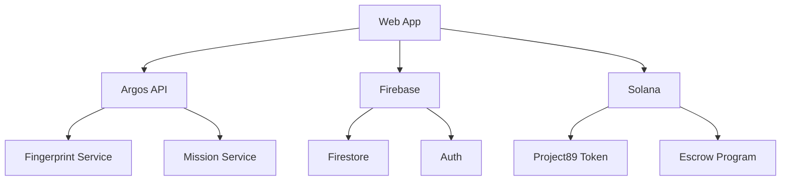

# Project 89 Mission App "H1V3M1ND" Technical Specification

## System Architecture

### Component Overview


## Data Models

### Mission Schema
```typescript
interface Mission {
  id: string;
  title: string;
  description: string;
  requirements: {
    fingerprints: string[];
    stakeAmount?: number;    // Project89 tokens
    timeLimit?: number;
  };
  rewards: {
    tokenAmount: number;     // Project89 tokens
    tokenMint: string;       // Project89 mint address
    experience: number;
  };
  burnAmount?: number;       // Project89 tokens to burn on failure
  escrowAddress: string;
  status: 'active' | 'completed' | 'expired';
  createdAt: timestamp;
  expiryDate: timestamp;
  participants: {
    [userId: string]: {
      status: 'claimed' | 'in-progress' | 'completed' | 'failed';
      progress: {
        fingerprintsMatched: string[];
        lastUpdate: timestamp;
      };
      stakeTransaction?: string;
      Project89Balance?: number;
    };
  };
}
```

### User Schema
```typescript
interface User {
  id: string;
  walletAddress: string;
  displayName?: string;
  stats: {
    missionsCompleted: number;
    totalRewards: number;
    reputation: number;
  };
  preferences: {
    notifications: boolean;
    theme: 'light' | 'dark';
  };
  timestamps: {
    created: timestamp;
    lastActive: timestamp;
  };
}
```

### Fingerprint Schema
```typescript
interface Fingerprint {
  id: string;
  missionId: string;
  type: string;
  metadata?: {
    difficulty?: number;
    hints?: string[];
    description?: string;
  };
  matches: Array<{
    userId: string;
    timestamp: timestamp;
    verified: boolean;
  }>;
  status: 'active' | 'completed';
}
```

## Implementation Details

### Authentication Flow
```typescript
async function authenticateUser(wallet: Wallet): Promise<User> {
  // 1. Request wallet connection
  const connection = await wallet.connect();
  
  // 2. Get nonce from Firebase
  const nonce = await firebase.auth().getNonce();
  
  // 3. Sign message with wallet
  const signature = await wallet.signMessage(
    `Authenticate with H1V3M1ND: ${nonce}`
  );
  
  // 4. Verify signature and get token
  const { token, user } = await firebase
    .auth()
    .signInWithCustomToken(signature);
  
  return user;
}
```

### Mission Creation Flow
```typescript
async function createMission(
  mission: MissionInput,
  creator: User
): Promise<Mission> {
  // 1. Validate Project89 balance
  const balance = await getProject89Balance(creator.walletAddress);
  if (balance < mission.rewards.tokenAmount) {
    throw new Error('Insufficient Project89 balance');
  }
  
  // 2. Create escrow account
  const escrow = await createProject89Escrow(
    mission.rewards.tokenAmount,
    creator.walletAddress
  );
  
  // 3. Store mission data
  const missionDoc = await firebase
    .firestore()
    .collection('missions')
    .add({
      ...mission,
      escrowAddress: escrow.address,
      status: 'active',
      createdAt: firebase.firestore.FieldValue.serverTimestamp(),
    });
  
  // 4. Register fingerprints
  await argosApi.registerFingerprints(
    mission.requirements.fingerprints,
    missionDoc.id
  );
  
  return missionDoc;
}
```

### Verification System
```typescript
interface VerificationNode {
  id: string;
  type: 'creator' | 'community';
  weight: number;
  response?: {
    approved: boolean;
    timestamp: timestamp;
    notes?: string;
  };
}

async function verifyMissionCompletion(
  missionId: string,
  submission: Submission
): Promise<boolean> {
  // 1. Select verification nodes
  const nodes = await selectVerificationNodes(missionId);
  
  // 2. Collect votes
  const votes = await collectVerificationVotes(nodes, submission);
  
  // 3. Calculate consensus
  const consensus = calculateConsensus(votes);
  
  // 4. Process result
  if (consensus.approved) {
    await processMissionReward(missionId, submission.userId);
  }
  
  return consensus.approved;
}
```

### Token Operations
```typescript
interface TokenOperations {
  async stake(
    amount: number,
    wallet: string
  ): Promise<TransactionSignature> {
    const ix = await createStakeInstruction(amount, wallet);
    return sendAndConfirmTransaction(ix);
  }
  
  async reward(
    amount: number,
    recipient: string
  ): Promise<TransactionSignature> {
    const ix = await createRewardInstruction(amount, recipient);
    return sendAndConfirmTransaction(ix);
  }
  
  async burn(
    amount: number,
    wallet: string
  ): Promise<TransactionSignature> {
    const ix = await createBurnInstruction(amount, wallet);
    return sendAndConfirmTransaction(ix);
  }
}
```

## Security Measures

### Transaction Security
```typescript
interface TransactionGuard {
  // Verify transaction hasn't been tampered with
  verifyTransaction(tx: Transaction): Promise<boolean>;
  
  // Check for double-spending
  checkDoubleSpend(tx: Transaction): Promise<boolean>;
  
  // Validate token amounts
  validateAmounts(tx: Transaction): Promise<boolean>;
}
```

### Rate Limiting
```typescript
interface RateLimiter {
  // User-based limits
  userLimits: {
    missions: number;    // Per hour
    verifications: number; // Per day
    submissions: number;   // Per day
  };
  
  // IP-based limits
  ipLimits: {
    requests: number;     // Per minute
    connections: number;  // Per hour
  };
}
```

### Data Validation
```typescript
interface ValidationRules {
  mission: {
    title: { minLength: 5, maxLength: 100 },
    description: { minLength: 20, maxLength: 1000 },
    rewards: {
      min: 1,
      max: 1000000,
    },
    fingerprints: {
      min: 1,
      max: 10,
    },
  };
  
  user: {
    displayName: { minLength: 3, maxLength: 50 },
    walletAddress: { pattern: /^[A-Za-z0-9]{32,44}$/ },
  };
}
```

## Error Handling

### Error Types
```typescript
enum ErrorType {
  VALIDATION_ERROR = 'VALIDATION_ERROR',
  AUTHENTICATION_ERROR = 'AUTHENTICATION_ERROR',
  INSUFFICIENT_FUNDS = 'INSUFFICIENT_FUNDS',
  TRANSACTION_ERROR = 'TRANSACTION_ERROR',
  RATE_LIMIT_ERROR = 'RATE_LIMIT_ERROR',
  SERVER_ERROR = 'SERVER_ERROR',
}

interface AppError extends Error {
  type: ErrorType;
  code: string;
  details?: any;
  timestamp: number;
}
```

### Error Recovery
```typescript
interface ErrorRecovery {
  // Retry failed transactions
  async retryTransaction(
    tx: Transaction,
    attempts: number
  ): Promise<boolean>;
  
  // Rollback changes on failure
  async rollback(
    operation: Operation,
    context: Context
  ): Promise<void>;
  
  // Log errors for monitoring
  async logError(
    error: AppError,
    context: Context
  ): Promise<void>;
}
```

## Monitoring & Analytics

### Metrics
```typescript
interface Metrics {
  // Mission metrics
  missions: {
    created: number;
    completed: number;
    failed: number;
    averageCompletion: number;
  };
  
  // Token metrics
  tokens: {
    staked: number;
    rewarded: number;
    burned: number;
    circulation: number;
  };
  
  // User metrics
  users: {
    active: number;
    new: number;
    retention: number;
  };
}
```

### Logging
```typescript
interface LogLevel {
  DEBUG = 0,
  INFO = 1,
  WARN = 2,
  ERROR = 3,
  FATAL = 4,
}

interface Logger {
  log(
    level: LogLevel,
    message: string,
    context?: any
  ): void;
  
  error(
    error: Error,
    context?: any
  ): void;
  
  metric(
    name: string,
    value: number,
    tags?: Record<string, string>
  ): void;
}
```

## Testing Strategy

### Unit Tests
```typescript
interface TestSuite {
  // Test mission creation
  testMissionCreation(): Promise<void>;
  
  // Test verification system
  testVerification(): Promise<void>;
  
  // Test token operations
  testTokenOperations(): Promise<void>;
  
  // Test error handling
  testErrorHandling(): Promise<void>;
}
```

### Integration Tests
```typescript
interface IntegrationTests {
  // Test complete mission flow
  testMissionFlow(): Promise<void>;
  
  // Test authentication flow
  testAuthFlow(): Promise<void>;
  
  // Test token integration
  testTokenIntegration(): Promise<void>;
}
```

### Load Tests
```typescript
interface LoadTest {
  // Simulate concurrent users
  simulateUsers(count: number): Promise<void>;
  
  // Measure response times
  measureLatency(): Promise<Metrics>;
  
  // Test system limits
  testLimits(): Promise<void>;
}