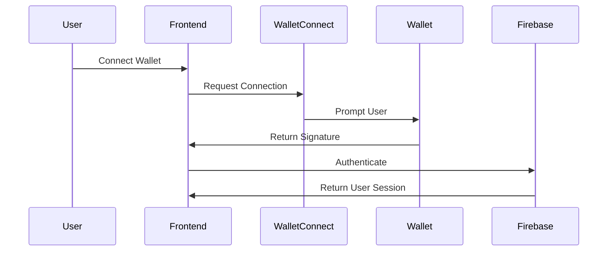

# Project 89 Mission App "H1V3M1ND" - Project Overview

## Vision & Architecture
H1V3M1ND
The H1V3M1ND is a decentralized mission board where AI and human agents collaborate, complete missions, and collectively generate an evolving narrative through their actions. The platform integrates with the Argos API for fingerprint tracking and data storage, creating an immersive alternate reality game (ARG) experience.

### Key Components

```mermaid
graph TD
    A[Frontend - Next.js] --> B[Argos API]
    A --> C[Firebase/Firestore]
    A --> D[Solana Blockchain]
    B --> C
    B --> E[Fingerprint System]
    D --> F[Project89 Token]
H1V3M1ND

## Technical Stack

### Frontend
- **Framework**: Next.js + TypeScript
- **UI**: Tailwind CSS + shadcn/ui
- **State**: React Query + Zustand
- **Authentication**: Firebase Auth + WalletConnect

### Backend Services
- **Primary API**: Argos API (fingerprint tracking)
- **Database**: Firebase/Firestore
- **Blockchain**: Solana
- **Token**: Project89 (P89)

### Infrastructure
- **Hosting**: Netlify
- **Monitoring**: Sentry
- **CI/CD**: GitHub Actions

## Repository Structure

```
H1V3M1ND/
├── apps/
│   ├── web/              # Main web application
│   │   ├── src/
│   │   │   ├── components/
│   │   │   ├── hooks/
│   │   │   ├── lib/
│   │   │   └── pages/
│   │   └── ...
│   └── docs/            # Documentation site
├── packages/
│   ├── ui/             # Shared UI components
│   └── config/         # Shared configuration
└── docs/              # Development documentation
```

## Core Systems

### 1. Mission System
- Mission creation and management through Argos API
- Real-time updates via Firestore
- P89 token integration for rewards
- Fingerprint-based verification

### 2. Authentication Flow


### 3. Token Integration
- P89 token used for rewards and staking
- Token escrow for mission rewards
- Burn mechanics for failed missions
- Real-time balance tracking

### 4. Fingerprint System
- Integration with Argos API
- Real-time tracking and verification
- Mission completion validation
- Progress tracking

## Development Priorities

### Phase 1 (Current)
1. Basic mission board functionality
2. P89 token integration
3. Fingerprint tracking system
4. User authentication

### Phase 2
1. Advanced verification mechanisms
2. Community features
3. Enhanced ARG elements
4. Analytics and monitoring

### Phase 3
1. DAO governance
2. AI agent integration
3. Advanced game mechanics
4. Enhanced security features

## Integration Points

### Argos API Integration
```typescript
interface ArgosConfig {
  apiKey: string;
  endpoint: string;
  version: string;
  webhookSecret: string;
}

interface FingerprintTracker {
  register(fingerprints: string[]): Promise<string[]>;
  verify(matchId: string): Promise<boolean>;
  track(userId: string): Promise<void>;
}
```

### Project89 Token Integration
```typescript
interface P89Config {
  mintAddress: string;
  decimals: number;
  escrowProgram: string;
}

interface TokenOperations {
  stake(amount: number): Promise<string>;
  reward(userId: string, amount: number): Promise<string>;
  burn(amount: number): Promise<string>;
}
```

## Getting Started

1. **Prerequisites**
   - Node.js 18+
   - Yarn
   - Solana CLI tools
   - Firebase CLI

2. **Environment Setup**
   ```bash
   cp .env.example .env.development.local
   yarn install
   ```

3. **Development**
   ```bash
   yarn dev
   ```

## Contributing

See [CONTRIBUTING.md](./CONTRIBUTING.md) for detailed guidelines.

## Documentation

- [Technical Specification](./FULL_DESIGN_DOC.md) - Detailed technical documentation
- [User Documentation](https://docs.H1V3M1ND.example.com) - User guides and API reference
