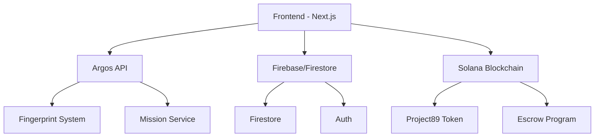
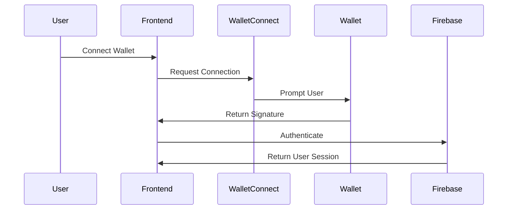
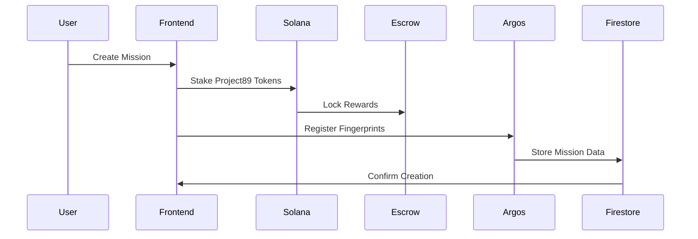

import { Callout } from 'nextra/components'

# System Architecture

<Callout type="info">
  The H1V3M1ND platform is built on a modern, distributed architecture that combines blockchain technology, cloud services, and real-time data processing to create a seamless ARG experience.
</Callout>

## System Overview

## Core Components

### Frontend Layer
- **Next.js Application**: Server-side rendered React application
- **State Management**: Combination of React Query for server state and Zustand for local state
- **UI Components**: Custom component library built on shadcn/ui and Tailwind CSS
- **Wallet Integration**: WalletConnect for Solana wallet interactions

### API Layer
- **Argos API**: Core service for fingerprint tracking and mission management
  - RESTful endpoints for mission CRUD operations
  - WebSocket connections for real-time updates
  - Fingerprint verification system

### Data Layer
- **Firebase/Firestore**
  - Real-time database for mission and user data
  - Authentication service integration
  - Scalable document-based storage

### Blockchain Layer
- **Solana Network**
  - Project89 token contract
  - Escrow program for mission rewards
  - On-chain verification system

## Data Flow

### Authentication Flow

### Mission Creation Flow

## System Integration

### Argos API Integration
The Argos API serves as the backbone for mission tracking and verification:
- RESTful endpoints for CRUD operations
- WebSocket connections for real-time updates
- Fingerprint verification system
- Mission progress tracking

### Firebase Integration
Firebase provides authentication and real-time data storage:
- User authentication with wallet signatures
- Real-time mission updates
- User profile and progress tracking
- Analytics and monitoring

### Solana Integration
The Solana blockchain handles all token operations:
- Project89 token transactions
- Escrow program for mission rewards
- On-chain verification
- Transaction monitoring

## Scalability & Performance

### Caching Strategy
- Client-side caching with React Query
- Firebase cache for frequently accessed data
- CDN caching for static assets

### Load Balancing
- Distributed API endpoints
- Multiple Firebase instances
- Geographic distribution

### Performance Monitoring
- Real-time metrics collection
- Performance tracking
- Error monitoring with Sentry
- Custom analytics dashboard

## Security Measures

### Authentication Security
- Wallet signature verification
- Firebase authentication tokens
- Rate limiting on auth endpoints
- Session management

### Data Security
- End-to-end encryption for sensitive data
- Role-based access control
- Input validation and sanitization
- Regular security audits

### Transaction Security
- Multi-signature requirements
- Transaction verification
- Double-spend prevention
- Amount validation

## Deployment Architecture

### Development Environment
- Local development setup
- Firebase emulators
- Solana testnet
- Mock Argos API

### Staging Environment
- Netlify preview deployments
- Firebase staging project
- Solana devnet
- Staging Argos API

### Production Environment
- Netlify production deployment
- Firebase production project
- Solana mainnet
- Production Argos API

## Monitoring & Logging

### System Metrics
- API response times
- Database performance
- Blockchain transaction status
- User engagement metrics

### Error Tracking
- Sentry integration
- Custom error reporting
- Alert systems
- Error recovery procedures

### Analytics
- User behavior tracking
- Mission completion rates
- Token economics metrics
- System performance analytics 